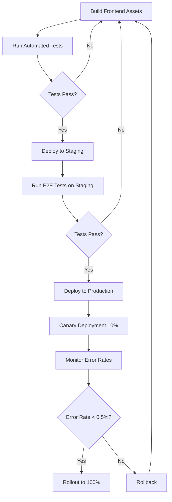
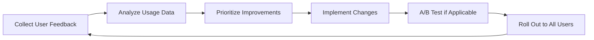

# Fontaine Sante Frontend UI Testing and Implementation Plan

## Overview

This document outlines the comprehensive testing and implementation strategy for the Fontaine Sante Supplier Management Dashboard frontend. The plan aligns with Phases 5 and 6 of the conceptual framework (Testing and Refinement; Implementation and Monitoring).

## 1. Testing Strategy

### 1.1 Component Testing

#### Unit Tests
| Component Category | Test Focus | Testing Tools | Success Criteria |
|-------------------|------------|--------------|------------------|
| UI Components | Props validation, rendering, state changes | Jest, React Testing Library | 90% test coverage |
| Forms | Validation logic, submission handling | Jest, React Testing Library | All validation cases covered |
| Charts/Visualizations | Data handling, rendering, interactions | Jest, React Testing Library | Correct visualization for various data scenarios |
| Custom Hooks | State management, side effects | React Hooks Testing Library | All state transitions tested |

#### Integration Tests
| Integration Point | Test Focus | Testing Tools | Success Criteria |
|-------------------|------------|--------------|------------------|
| API Services | Data fetching, error handling | MSW (Mock Service Worker) | All API endpoints properly integrated |
| Redux Store | Action dispatching, state updates | Redux Mock Store | State changes as expected for all actions |
| Route Navigation | Page transitions, parameter handling | React Router Test Utils | Correct routing for all user flows |
| Component Trees | Parent-child communication | React Testing Library | Data flows correctly between components |

### 1.2 E2E Testing

| User Flow | Test Scenarios | Testing Tools | Success Criteria |
|-----------|---------------|--------------|------------------|
| Dashboard Navigation | Menu navigation, panel switching | Cypress | All navigation paths function correctly |
| Data Filtering | Filter application, results display | Cypress | Filters correctly affect displayed data |
| Data Entry | Form submission, validation errors | Cypress | Forms submit correctly, validation works |
| Data Visualization | Chart interactions, tooltips | Cypress | All interactive elements function properly |
| Report Generation | Report configuration, export | Cypress | Reports generated and exported correctly |

### 1.3 Performance Testing

| Performance Aspect | Test Method | Tools | Benchmarks |
|-------------------|------------|-------|------------|
| Initial Load Time | Lighthouse metrics | Chrome DevTools | First Contentful Paint < 1.5s |
| Runtime Performance | Frame rate monitoring | React Profiler | 60fps for animations and transitions |
| Memory Usage | Heap snapshots | Chrome DevTools | No memory leaks after extended use |
| Network Optimization | Bundle size analysis | Webpack Bundle Analyzer | Total JS bundle < 500KB (initial load) |
| Rendering Optimization | Component re-renders | why-did-you-render | No unnecessary re-renders |

### 1.4 Accessibility Testing

| Accessibility Aspect | Test Method | Tools | Success Criteria |
|---------------------|------------|-------|------------------|
| Keyboard Navigation | Manual testing | - | All interactions possible via keyboard |
| Screen Reader Compatibility | Manual testing | NVDA, VoiceOver | All content accessible via screen reader |
| Color Contrast | Automated scanning | axe DevTools | WCAG 2.1 AA compliance |
| Semantic HTML | Code review, automated tests | HTMLHint, eslint-plugin-jsx-a11y | Proper HTML structure throughout app |
| Focus Management | Manual testing | - | Logical focus order, visible focus indicators |

### 1.5 Cross-Browser Testing

| Browser | Versions | Test Method | Success Criteria |
|---------|----------|------------|------------------|
| Chrome | Latest, Latest-1 | Manual + BrowserStack | Identical functionality and appearance |
| Firefox | Latest, Latest-1 | Manual + BrowserStack | Identical functionality and appearance |
| Safari | Latest, Latest-1 | BrowserStack | Identical functionality and appearance |
| Edge | Latest | Manual + BrowserStack | Identical functionality and appearance |
| Mobile Safari | iOS 14+ | BrowserStack | Functional on mobile devices |
| Mobile Chrome | Android 10+ | BrowserStack | Functional on mobile devices |

### 1.6 User Acceptance Testing

| Stakeholder Group | Test Focus | Methodology | Success Criteria |
|-------------------|------------|------------|------------------|
| Procurement Team | Supplier data accuracy, filtering | Guided testing sessions | 90% task completion rate |
| Quality Team | Quality metrics visualization | Scenario-based testing | Positive feedback on data clarity |
| Sustainability Team | Environmental impact visualization | Prototype review sessions | All required metrics accessible |
| Executive Team | High-level reporting, KPIs | Demonstration and feedback | Reports meet decision-making needs |
| IT Administrators | System configuration, user management | Hands-on testing | All admin functions working correctly |

## 2. Implementation Plan

### 2.1 Phased Rollout Strategy

| Phase | Components | Timeline | Acceptance Criteria | Stakeholders |
|-------|------------|----------|---------------------|--------------|
| **Alpha Release** | Core dashboard, basic visualizations | Week 1-2 | Internal testing complete | Development team, QA team |
| **Beta Release** | Complete UI, full integration with API | Week 3-4 | Successful UAT with key users | Department representatives |
| **Pilot Release** | Full system, limited user group | Week 5-6 | No critical issues for 1 week | Selected users from each department |
| **Full Deployment** | All features, all users | Week 7-8 | All features functional | All end users |

### 2.2 Feature Flag Implementation

| Feature | Flag Name | Default State | Activation Criteria | Fallback Behavior |
|---------|-----------|--------------|---------------------|-------------------|
| Real-time Updates | `enableRealTimeUpdates` | Off | Successful WebSocket testing | Periodic polling |
| Predictive Analytics | `enablePredictions` | Off | Backend models validated | Hide prediction UI |
| Advanced Filtering | `enableAdvancedFilters` | Off | Performance testing passed | Basic filters only |
| Export Capabilities | `enableExports` | On | PDF/Excel generation tested | CSV download only |
| Map Visualizations | `enableMaps` | On | Map rendering optimized | Tabular data view |

### 2.3 Deployment Process



### 2.4 Training Program

| User Group | Training Format | Duration | Content Focus | Materials |
|------------|----------------|----------|--------------|-----------|
| Regular Users | Interactive Webinar | 2 hours | Navigation, basic features | User guide, video tutorials |
| Power Users | Workshop | 1 day | Advanced features, data analysis | Comprehensive manual, practice exercises |
| IT Support | Technical training | 2 days | System architecture, troubleshooting | Technical documentation, admin guide |
| New Employees | Self-paced course | 3 hours | Basic functionality | eLearning modules, quick reference guides |

### 2.5 Change Management Plan

| Stakeholder Group | Communication Channel | Frequency | Key Messages | Success Metrics |
|-------------------|----------------------|-----------|--------------|----------------|
| Leadership | Executive briefings | Bi-weekly | Strategic benefits, ROI | Executive adoption rate |
| Department Heads | Implementation workshops | Weekly | Departmental benefits, rollout schedule | Department adoption rates |
| End Users | Email updates, team meetings | Weekly | Feature announcements, training opportunities | User engagement metrics |
| IT Department | Technical documentation | As needed | Technical changes, support procedures | Support ticket volume |

### 2.6 Documentation Strategy

| Document Type | Primary Audience | Format | Update Frequency | Distribution Method |
|---------------|-----------------|--------|------------------|---------------------|
| User Guide | End users | Web-based, PDF | Major releases | In-app help center |
| Admin Guide | IT administrators | Web-based, PDF | Every release | IT knowledge base |
| API Documentation | Developers | Interactive (Swagger) | Every API change | Developer portal |
| Release Notes | All stakeholders | Web page | Every release | Email, in-app notification |
| Training Materials | End users | Videos, interactive tutorials | Major releases | Learning management system |

## 3. Monitoring and Continuous Improvement

### 3.1 Monitoring Implementation

| Metric Category | Key Metrics | Monitoring Tools | Alert Thresholds |
|----------------|------------|-----------------|------------------|
| Frontend Performance | Page load time, Time to Interactive | New Relic, Google Analytics | TTI > 3s |
| User Engagement | Active users, Session duration, Feature usage | Google Analytics, Custom events | Usage drop > 20% |
| Error Tracking | JS exceptions, API failures | Sentry | Error rate > 0.5% |
| Accessibility | WCAG compliance score | axe Monitor | Score < 90% |
| User Satisfaction | CSAT, NPS, feature-specific feedback | In-app surveys | NPS < 30 |

### 3.2 Feedback Collection Mechanism

| Feedback Type | Collection Method | Processing Approach | Response Time |
|---------------|-------------------|---------------------|---------------|
| Bug Reports | In-app reporting tool | Auto-categorization | 24 hours |
| Feature Requests | Feedback portal | Voting system | 1 week acknowledgment |
| Usability Issues | User testing sessions | Severity classification | Next sprint for high priority |
| Performance Issues | Automated + user reports | Impact assessment | 48 hours for critical issues |
| General Feedback | NPS surveys, in-app polls | Sentiment analysis | Bi-weekly review |

### 3.3 Iterative Improvement Cycle



### 3.4 KPI Tracking Dashboard

| KPI Category | Metrics | Visualization | Update Frequency | Target Values |
|--------------|---------|--------------|------------------|---------------|
| User Adoption | DAU/MAU ratio, feature usage % | Line chart, heat map | Daily | DAU/MAU > 50% |
| Performance | Page load speed, API response time | Line chart, histogram | Real-time | Load < 2s, Response < 500ms |
| Quality | Error rate, bug count by severity | Bar chart, line chart | Daily | Error rate < 0.1% |
| User Satisfaction | CSAT, NPS, support tickets | Gauge chart, trend line | Weekly | NPS > 40, CSAT > 4.2/5 |
| Business Impact | Time saved, decision quality | Before/after comparison | Monthly | 20% time reduction |

## 4. Technical Implementation Details

### 4.1 Testing Environment Setup

```yml
# docker-compose.yml for testing environment
version: '3'
services:
  frontend-testing:
    build:
      context: .
      dockerfile: Dockerfile.test
    volumes:
      - ./src:/app/src
      - ./coverage:/app/coverage
    environment:
      - NODE_ENV=test
      - API_MOCK=true
    ports:
      - "9000:9000"
    command: npm run test:coverage
  
  e2e-testing:
    build:
      context: .
      dockerfile: Dockerfile.cypress
    volumes:
      - ./cypress:/app/cypress
      - ./cypress-results:/app/cypress-results
    environment:
      - CYPRESS_baseUrl=http://frontend-staging:3000
    depends_on:
      - frontend-staging
    command: cypress run
  
  frontend-staging:
    build:
      context: .
      dockerfile: Dockerfile
    environment:
      - NODE_ENV=staging
      - API_ENDPOINT=http://mock-api:4000
    ports:
      - "3000:3000"
  
  mock-api:
    image: mockserver/mockserver
    ports:
      - "4000:4000"
    environment:
      - MOCKSERVER_INITIALIZATION_JSON_PATH=/config/mockserver.json
    volumes:
      - ./mock-api:/config
```

### 4.2 CI/CD Pipeline Configuration

```yml
# .github/workflows/frontend-pipeline.yml
name: Frontend CI/CD Pipeline

on:
  push:
    branches: [ main, develop ]
  pull_request:
    branches: [ main, develop ]

jobs:
  lint:
    runs-on: ubuntu-latest
    steps:
      - uses: actions/checkout@v2
      - name: Setup Node.js
        uses: actions/setup-node@v2
        with:
          node-version: '16'
      - name: Install dependencies
        run: npm ci
      - name: Lint code
        run: npm run lint
  
  test:
    needs: lint
    runs-on: ubuntu-latest
    steps:
      - uses: actions/checkout@v2
      - name: Setup Node.js
        uses: actions/setup-node@v2
        with:
          node-version: '16'
      - name: Install dependencies
        run: npm ci
      - name: Run unit tests
        run: npm run test:coverage
      - name: Upload coverage
        uses: codecov/codecov-action@v2
  
  build:
    needs: test
    runs-on: ubuntu-latest
    steps:
      - uses: actions/checkout@v2
      - name: Setup Node.js
        uses: actions/setup-node@v2
        with:
          node-version: '16'
      - name: Install dependencies
        run: npm ci
      - name: Build
        run: npm run build
      - name: Archive build
        uses: actions/upload-artifact@v2
        with:
          name: build
          path: build
  
  e2e:
    needs: build
    runs-on: ubuntu-latest
    steps:
      - uses: actions/checkout@v2
      - name: Setup Node.js
        uses: actions/setup-node@v2
        with:
          node-version: '16'
      - name: Download build
        uses: actions/download-artifact@v2
        with:
          name: build
          path: build
      - name: Cypress run
        uses: cypress-io/github-action@v2
        with:
          start: npm run serve:build
          wait-on: 'http://localhost:5000'
  
  deploy-staging:
    if: github.ref == 'refs/heads/develop'
    needs: e2e
    runs-on: ubuntu-latest
    steps:
      - name: Download build
        uses: actions/download-artifact@v2
        with:
          name: build
          path: build
      - name: Deploy to staging
        # Deployment steps specific to your hosting platform
  
  deploy-production:
    if: github.ref == 'refs/heads/main'
    needs: e2e
    runs-on: ubuntu-latest
    steps:
      - name: Download build
        uses: actions/download-artifact@v2
        with:
          name: build
          path: build
      - name: Deploy to production
        # Deployment steps specific to your hosting platform
```

### 4.3 Feature Flag Implementation

```typescript
// src/config/featureFlags.ts
import { createContext, useContext, useState, useEffect, ReactNode } from 'react';

interface FeatureFlags {
  enableRealTimeUpdates: boolean;
  enablePredictions: boolean;
  enableAdvancedFilters: boolean;
  enableExports: boolean;
  enableMaps: boolean;
}

// Default values
const defaultFeatureFlags: FeatureFlags = {
  enableRealTimeUpdates: false,
  enablePredictions: false,
  enableAdvancedFilters: false,
  enableExports: true,
  enableMaps: true,
};

// Create context
const FeatureFlagsContext = createContext<FeatureFlags>(defaultFeatureFlags);

// Provider component
export const FeatureFlagsProvider = ({ children }: { children: ReactNode }) => {
  const [flags, setFlags] = useState<FeatureFlags>(defaultFeatureFlags);

  useEffect(() => {
    // Fetch feature flags from API or local storage
    const fetchFeatureFlags = async () => {
      try {
        const response = await fetch('/api/feature-flags');
        const data = await response.json();
        setFlags({ ...defaultFeatureFlags, ...data });
      } catch (error) {
        console.error('Failed to fetch feature flags:', error);
        // Fall back to defaults
        setFlags(defaultFeatureFlags);
      }
    };

    fetchFeatureFlags();
  }, []);

  return (
    <FeatureFlagsContext.Provider value={flags}>
      {children}
    </FeatureFlagsContext.Provider>
  );
};

// Hook for consuming flags
export const useFeatureFlags = () => useContext(FeatureFlagsContext);

// Usage example:
// const { enableMaps } = useFeatureFlags();
// if (enableMaps) { render map component }
```

### 4.4 Monitoring Implementation

```typescript
// src/utils/monitoring.ts
import * as Sentry from '@sentry/react';
import { BrowserTracing } from '@sentry/tracing';

// Custom event types
export enum EventType {
  PAGE_VIEW = 'page_view',
  FEATURE_USED = 'feature_used',
  ERROR = 'error',
  PERFORMANCE = 'performance',
  USER_FEEDBACK = 'user_feedback',
}

// Initialize monitoring
export const initializeMonitoring = () => {
  // Sentry for error tracking
  Sentry.init({
    dsn: process.env.REACT_APP_SENTRY_DSN,
    integrations: [new BrowserTracing()],
    tracesSampleRate: 0.1,
    environment: process.env.NODE_ENV,
  });

  // Custom performance monitoring
  if ('performance' in window && 'PerformanceObserver' in window) {
    // Track Core Web Vitals
    const observer = new PerformanceObserver((list) => {
      list.getEntries().forEach((entry) => {
        if (entry.entryType === 'largest-contentful-paint') {
          trackEvent(EventType.PERFORMANCE, {
            metric: 'LCP',
            value: entry.startTime,
          });
        }
        if (entry.entryType === 'first-input') {
          trackEvent(EventType.PERFORMANCE, {
            metric: 'FID',
            value: entry.processingStart - entry.startTime,
          });
        }
      });
    });
    
    observer.observe({ type: 'largest-contentful-paint', buffered: true });
    observer.observe({ type: 'first-input', buffered: true });
  }
};

// Track custom events
export const trackEvent = (type: EventType, data: Record<string, any>) => {
  // Send to analytics service
  if (window.gtag) {
    window.gtag('event', type, data);
  }
  
  // Log in development
  if (process.env.NODE_ENV === 'development') {
    console.log(`[Event] ${type}:`, data);
  }
  
  // For errors, also send to Sentry
  if (type === EventType.ERROR) {
    Sentry.captureEvent({
      message: data.message || 'Unknown error',
      level: data.level || 'error',
      extra: data,
    });
  }
};

// User feedback collection
export const collectFeedback = (rating: number, feedback: string, context: string) => {
  trackEvent(EventType.USER_FEEDBACK, {
    rating,
    feedback,
    context,
    timestamp: new Date().toISOString(),
  });
  
  return fetch('/api/feedback', {
    method: 'POST',
    headers: { 'Content-Type': 'application/json' },
    body: JSON.stringify({ rating, feedback, context }),
  });
};
```

## 5. Risk Management

### 5.1 Implementation Risks and Mitigations

| Risk | Probability | Impact | Mitigation Strategy |
|------|------------|--------|---------------------|
| API integration delays | Medium | High | Develop with mock API, parallel backend/frontend development |
| Performance issues with large datasets | High | High | Implement virtualization, pagination, data sampling |
| Browser compatibility issues | Medium | Medium | Cross-browser testing early, graceful degradation |
| User adoption resistance | Medium | High | Involve users early, comprehensive training, feedback cycles |
| Security vulnerabilities | Low | Critical | Security code review, penetration testing, dependency scanning |
| Accessibility compliance failures | Medium | High | Early accessibility testing, expert review |
| Mobile responsiveness issues | Medium | Medium | Mobile-first development, dedicated mobile testing |

### 5.2 Contingency Plans

| Scenario | Trigger | Response Plan | Responsible Team |
|----------|---------|--------------|------------------|
| Major bug in production | Error rate > 1% | Roll back to previous version | DevOps, Development |
| Performance degradation | Page load > 3s | Implement emergency optimizations | Performance team |
| Data inconsistency | Data validation failures | Switch to read-only mode | Data team, Development |
| User interface confusion | Support tickets spike | Deploy simplified UI, additional tooltips | UX team |
| Integration failure | API error rate > 5% | Fall back to cached data | Backend, Frontend teams |

## 6. Success Metrics

### 6.1 Implementation Success Metrics

| Metric | Target | Measurement Method | Evaluation Timeline |
|--------|--------|-------------------|---------------------|
| Deployment completion | 100% of features | Feature checklist | End of implementation |
| Test coverage | > 85% | Test coverage reports | Continuous |
| Bug density | < 0.1 bugs per 1000 LOC | Static analysis, manual testing | Weekly |
| Implementation timeline | Within 2 weeks of target | Project management tracking | End of implementation |
| Stakeholder sign-off | All key stakeholders | Formal acceptance | End of each phase |

### 6.2 User Adoption Metrics

| Metric | Target | Measurement Method | Evaluation Timeline |
|--------|--------|-------------------|---------------------|
| Active users | 80% of target users | Analytics tracking | 30 days post-launch |
| Feature utilization | > 70% of features used | Feature usage tracking | 60 days post-launch |
| Task completion rate | > 90% | User testing, analytics | 30 days post-launch |
| Training completion | 100% of users | LMS tracking | Launch + 2 weeks |
| Support ticket volume | < 0.5 per user per month | Support system tracking | Ongoing |

### 6.3 Business Impact Metrics

| Metric | Target | Measurement Method | Evaluation Timeline |
|--------|--------|-------------------|---------------------|
| Time savings | 20% reduction in procurement processes | Before/after time studies | 90 days post-launch |
| Data quality improvement | 30% reduction in data errors | Error tracking | 60 days post-launch |
| Decision-making speed | 25% faster supplier decisions | Process timing metrics | 90 days post-launch |
| Supplier performance visibility | 100% of suppliers have scorecard | System coverage metrics | 30 days post-launch |
| Cost savings from better decisions | 5% reduction in procurement costs | Financial tracking | 6 months post-launch |
