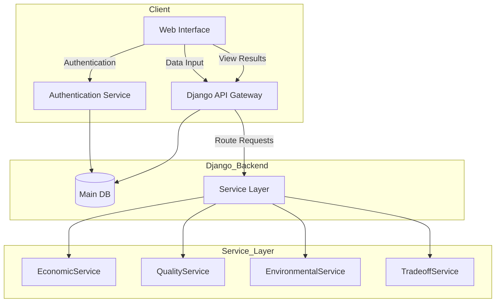

# Fontaine Santé Supply Chain Optimization System
## Project Plan Documentation

## Table of Contents
1. [System Overview](#system-overview)
2. [Technical Stack](#technical-stack)
3. [System Architecture](#system-architecture)
4. [Component Details](#component-details)
5. [Database Schema](#database-schema)
6. [API Documentation](#api-documentation)
7. [Implementation Guide](#implementation-guide)
8. [Testing Strategy](#testing-strategy)
9. [Deployment Plan](#deployment-plan)

## 1. System Overview

The Fontaine Santé Supply Chain Optimization System is composed of four main engines:
- Economic Optimization Engine
- Quality Assessment Engine
- Environmental Impact Assessment Engine
- Trade-off Analytics Engine

Each engine is designed to work independently while also integrating seamlessly for comprehensive supply chain optimization.

## 2. Technical Stack

### Backend
- **Django Framework**
  - Handles user authentication
  - Manages database models
  - Provides API gateway

- **FastAPI**
  - Processes complex calculations
  - Handles optimization logic


- **Service Layer**
  - Custom middleware for Django-FastAPI communication
  - Handles request routing and data transformation

### Database
- **PostgreSQL**
  - Primary database for Django models
  - Version: 14.x

### Additional Libraries
- **NumPy & Pandas**: Data processing
- **PuLP**: Linear programming optimization
- **Scikit-learn**: Data normalization and analysis
- **Pydantic**: Data validation
- **Redis**: Caching (optional)

## 3. System Architecture

### Service Communication Flow


## 4. Component Details

### 4.1 Django Backend

#### Core Models
```python
# users/models.py
from django.contrib.auth.models import AbstractUser
from django.db import models

class User(AbstractUser):
    company = models.CharField(max_length=100)
    role = models.CharField(max_length=50)
    
# suppliers/models.py
class Supplier(models.Model):
    name = models.CharField(max_length=200)
    location = models.CharField(max_length=200)
    materials = models.ManyToManyField('Material')
    created_at = models.DateTimeField(auto_now_add=True)
    
class Material(models.Model):
    name = models.CharField(max_length=200)
    category = models.CharField(max_length=100)
    unit = models.CharField(max_length=20)

# assessments/models.py
class Assessment(models.Model):
    supplier = models.ForeignKey(Supplier, on_delete=models.CASCADE)
    economic_score = models.FloatField()
    quality_score = models.FloatField()
    environmental_score = models.FloatField()
    created_at = models.DateTimeField(auto_now_add=True)
```

#### API Views
```python
# api/views.py
from rest_framework import viewsets
from rest_framework.permissions import IsAuthenticated

class SupplierViewSet(viewsets.ModelViewSet):
    permission_classes = [IsAuthenticated]
    queryset = Supplier.objects.all()
    serializer_class = SupplierSerializer
    
    def perform_create(self, serializer):
        serializer.save(created_by=self.request.user)
```

### 4.2 FastAPI Backend

#### Economic Engine
```python
# economic/main.py
from fastapi import FastAPI, HTTPException
from pydantic import BaseModel

app = FastAPI()

class SupplierCost(BaseModel):
    supplier_id: int
    material_cost: float
    transportation_cost: float
    tax_rate: float

@app.post("/calculate-economic-score")
async def calculate_economic_score(data: SupplierCost):
    try:
        total_cost = data.material_cost + data.transportation_cost
        tax_amount = total_cost * data.tax_rate
        score = calculate_score(total_cost, tax_amount)
        return {"supplier_id": data.supplier_id, "score": score}
    except Exception as e:
        raise HTTPException(status_code=400, detail=str(e))
```

### 4.3 Service Layer

```python
# services/base.py
from typing import Dict, Any
import httpx
import asyncio

class BaseService:
    def __init__(self, fastapi_url: str):
        self.fastapi_url = fastapi_url
        self.client = httpx.AsyncClient()
        
    async def forward_request(self, endpoint: str, data: Dict[str, Any]):
        try:
            response = await self.client.post(
                f"{self.fastapi_url}/{endpoint}",
                json=data
            )
            return response.json()
        except Exception as e:
            logging.error(f"Service error: {str(e)}")
            raise
```

## 5. Database Schema

### Main Tables
```sql
-- Users and Authentication
CREATE TABLE users (
    id SERIAL PRIMARY KEY,
    username VARCHAR(150) UNIQUE NOT NULL,
    email VARCHAR(254) UNIQUE NOT NULL,
    company VARCHAR(100),
    role VARCHAR(50)
);

-- Suppliers
CREATE TABLE suppliers (
    id SERIAL PRIMARY KEY,
    name VARCHAR(200) NOT NULL,
    location VARCHAR(200),
    created_at TIMESTAMP DEFAULT CURRENT_TIMESTAMP
);

-- Materials
CREATE TABLE materials (
    id SERIAL PRIMARY KEY,
    name VARCHAR(200) NOT NULL,
    category VARCHAR(100),
    unit VARCHAR(20)
);

-- Assessments
CREATE TABLE assessments (
    id SERIAL PRIMARY KEY,
    supplier_id INTEGER REFERENCES suppliers(id),
    economic_score FLOAT,
    quality_score FLOAT,
    environmental_score FLOAT,
    created_at TIMESTAMP DEFAULT CURRENT_TIMESTAMP
);
```

## 6. API Documentation

### Economic Engine API
```python
@app.post("/api/v1/economic/calculate")
async def calculate_economic_score(data: SupplierCostData):
    """
    Calculate economic score for a supplier
    
    Parameters:
    - supplier_id: int
    - costs: Dict[str, float]
    - volumes: Dict[str, float]
    
    Returns:
    - economic_score: float
    - cost_breakdown: Dict[str, float]
    """
```

### Quality Assessment API
```python
@app.post("/api/v1/quality/assess")
async def assess_quality(data: QualityData):
    """
    Assess quality metrics for raw materials
    
    Parameters:
    - material_id: int
    - measurements: Dict[str, float]
    - standards: Dict[str, float]
    
    Returns:
    - quality_score: float
    - compliance_details: Dict[str, bool]
    """
```

[Continues in next section...]